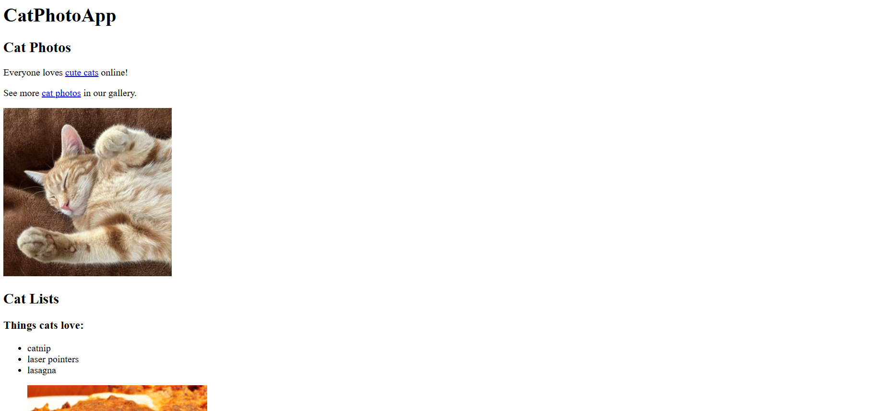

# Cat Photo App

This is a simple recipe page that uses basic HTML elements such as: headings, paragraphs, images, links, and lists.

The goal of this lab was to get hands-on practice with foundational HTML elements and understand how to structure a simple webpage.

In short, I learned how to properly structure a page with headings, paragraphs, and lists.

## Screenshot

