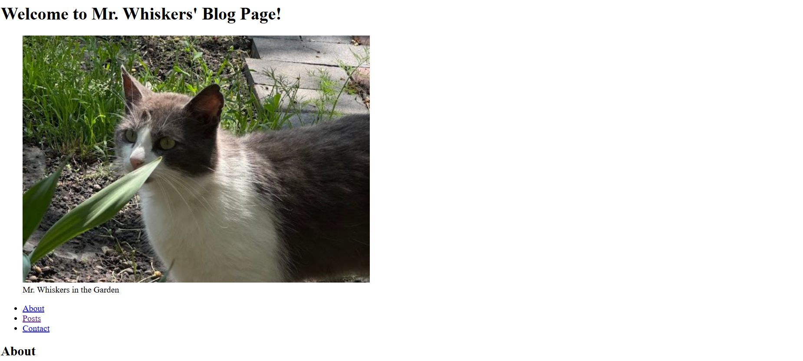

# Cat Blog

In this workshop I created a cat blog page to apply my learning of semantic html elements such as: `main`, `nav`, `article` and `footer` elements.

I learned and applied the `address` element. I also learned how to link the company's phone number and email to the `anchor` tag so that when the user presses on the link, the website will take them directly to the company's email address or the phone number to be called. Since there was tons of text needed to make the website seem real, I used placeholder text from the lorem ipsum site.

## Screenshot

