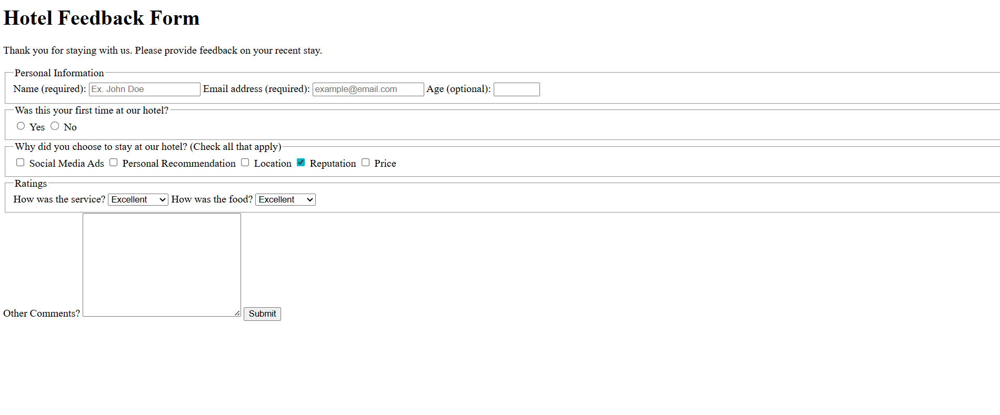

# Hotel Feedback Form

I built this project to learn different input types. It's a simple form that collects user info by using different inputs and attributes.

This was my first form created, a bit challenging with labels and inputs, but with much practice I will get the hang of it.

I learned to group different form sections using the `fieldset` element. I got to practice using different input types, then I gave appropriate attributes to `label`, `form`, and `input` elements. I also learned the `select` element, which was a bit more fun.

# Screenshot

