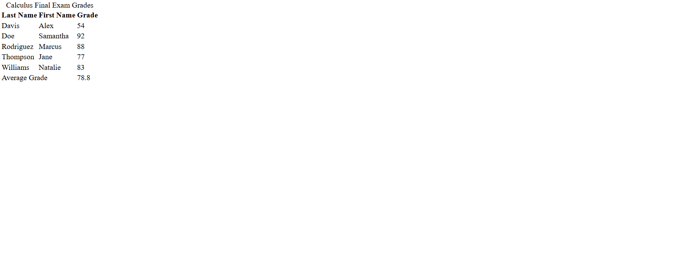

# Final Exam Time Table

This is an exam time table that shows students grades.

# Objective

This project was made to learn the `table` elemnt in html.

# Notes

- I learned how to apply the `caption` element
- I learned how to structure a table by using the `thead`, `th`, `tr`, and `tfoot` elements.

# Screenshot

