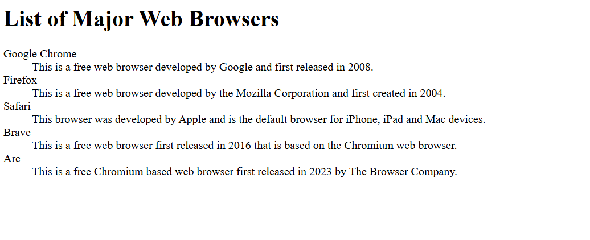

# List of Browsers and Descriptions

A simple webpage displaying major web browsers with their descriptions using a definition list.

## Features

- Definition list structure for term-description pairs
- Information about five major web browsers
- Clean, semantic HTML markup

## Technologies

- HTML5
- Definition list elements

## Browsers Included

- Google Chrome
- Firefox
- Safari
- Brave
- Arc

## SCreenshot

