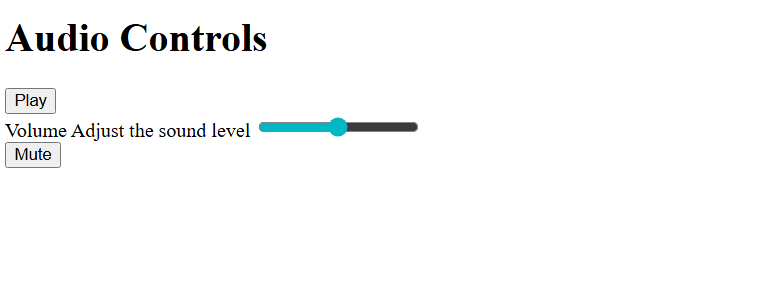

# Accessible Controls

A set of accessible audio controls demonstrating ARIA attributes for improved accessibility.

## Features

- Play and Mute buttons
- Volume slider with range input
- ARIA labels for screen reader support
- Descriptive labels and instructions for controls

## Technologies

- HTML5
- ARIA (Accessible Rich Internet Applications) attributes

## Controls Included

- **Play button** - Starts audio playback
- **Volume slider** - Adjusts sound level from 0-100
- **Mute button** - Toggles audio muting

## Schreenshot

